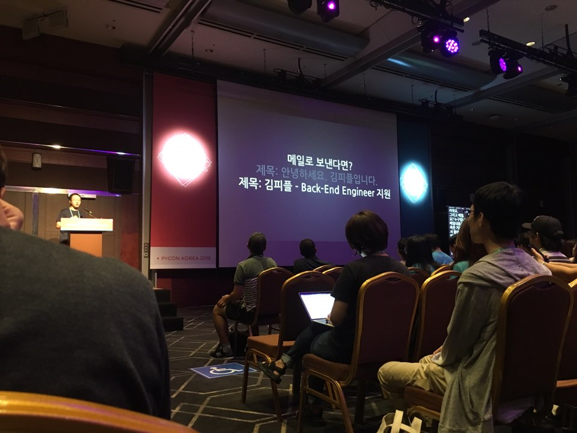
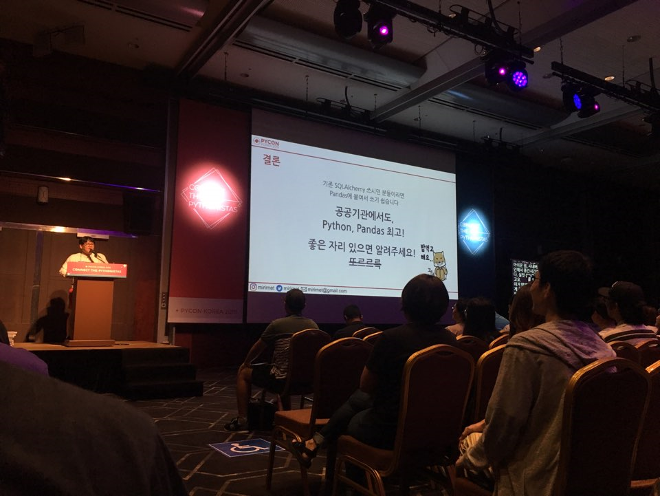
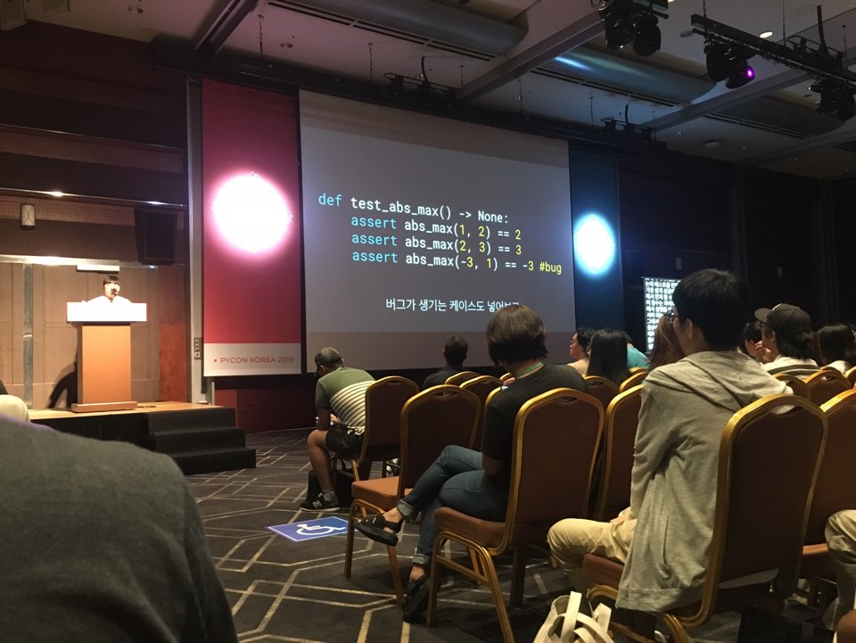

 

어머니 생신이라 중간에 나가 못들었던 라이트닝 토크.  
솔직히 제일 재밌었다.

 
 

### 라이트닝 토크 오프닝

라이트닝 토크 시작 전, 짤막한 레크리에이션을 했다.
분단을 나눠서 '파이콘'으로 화음을 만드는 건데...  
그런데....ㅋㅋㅋㅋㅋ  
왜 안되는 거지...ㅋㅋㅋㅋㅋ  

다함께 못하니 즐거운 불협화음이었다.

 

<iframe width="544" height="306" src="https://serviceapi.nmv.naver.com/flash/convertIframeTag.nhn?vid=D11F87463F3BE79EAFBC1AEC7FC67DCED3E8&outKey=V123c901f6fb62950aaeecbcc578007cc1c71adee7b32a07bde8ccbcc578007cc1c71" frameborder="no" scrolling="no" title="NaverVideo" allow="autoplay; gyroscope; accelerometer; encrypted-media" allowfullscreen></iframe>

 
 

 

### 본격 라이트닝 토크

라이트닝 토크에서는 10명 이상의 발표자들이 5분 이내에 짤막한 발표를 한다.  
라이트닝토크는 일반 발표 세션보다 더 가벼우면서 재밌게 들을 수 있어서 좋았다.

제일 인상 깊었던 건 2명인데 데이터 분석가가 되고 싶어 회사에 지원했다가 코딩을 못해 떨어졌던 이야기(이분 말씀도 잘하시고 재밌었는데 기술적인 문제때문에 발표를 다하지 못해 아쉬웠다), 그리고 카이스트 물리학 석사가 번개가 치는 현상을 파이썬으로 시각화해서 보여줬던 발표가 기억에 남는다. 피뢰침까지 구현해서 보여줬는데, 라이트닝 토크 전 발표 세션에서 신승우 님이 파이썬으로 물리 법칙을 실험해서 시각화해준 것과 비슷해 재밌었다.

그리고 다른 세션!

​ 
 

**1. 피플펀드컴퍼니 - 이력서, 자소서 tip**

저번 달에 취업성공패키지에서 취업교육훈련 때 들었던 내용과 비슷했다. ​ 
그럼에도 불구하고 나도 초반에는 비슷한 실수를 많이 했었다. (심지어 그렇게 하지 말라고 배웠는데도..ㅠㅠ) ​ 
어쩔 수 없이 여러 군데 지원하면서 실패해보고 실패 원인을 고쳐가는 수 밖에 없다.

 

 
 
​

**2. 파이썬으로 좀 더 나은 대중교통 만들기**

 

 

공공기관에서 일하시는 분인데, 좀 더 효율적인 배차 시스템을 위해(?)  
python, pandas를 이용해 통계를 내고 버스 시간을 예측했던 사례를 발표하셨다.

데이터 애널리틱스 강의 때 들었던 통계학 용어들을 오랜만에 들으니 정말...  
인간은 역시 망각의 동물이구나라는 것을 새삼 다시 느꼈다.

아무튼 거의 아웃사이더 급으로 빠르게 발표하셨다.  
이걸 받아 적으신 문자 통역사님은 얼마나 타자가 빠르신 걸까..?

 
 
​

**3. ​테스트 주도 개발**

테스트 케이스 순서 : 성공하는 케이스 -> 실패하는 케이스 -> 버그가 발생하는 케이스

 

 
 

 

### 마지막

마지막은 파이콘을 준비한 분들, 파이콘 행사 당시 고생하신 분들, 그리고 참가자 자신에게 박수를 보내며 훈훈한 마무리를 지었다.

조카들이 조금 커서, 코딩을 배울 수 있는 나이가 되면 함께 오고 싶다.

 
 
